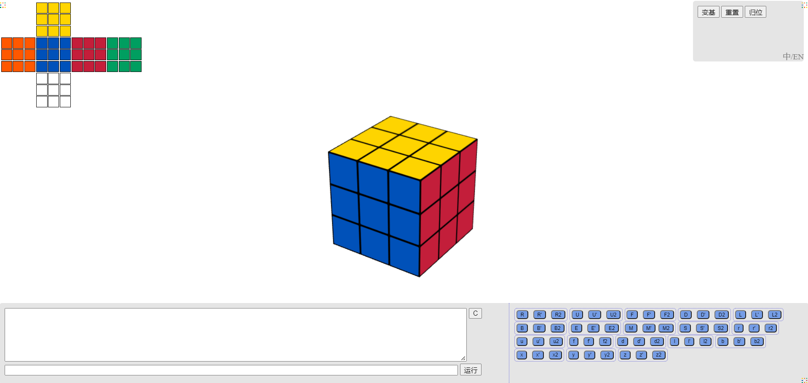

# rubik-cube

a rubik's cube game

## deploy

nginx:

```
    server {
        listen       80;
        server_name  localhost;

        ...

        ...


        location /rubik/ { # 末尾必须要有/
            alias   <项目路径>/rubik-cube/; # 末尾必须要有/
            autoindex on;
        }
```

## Demo

address : [rubik-cube](https://frogif.github.io/rubik-cube/)



## Reference

* https://github.com/liuxinyu95/unplugged
* https://github.com/newbieYoung/Threejs_rubik
* https://github.com/joews/rubik-js
* https://github.com/cs0x7f/min2phase
* http://kociemba.org/cube.htm
* https://github.com/hkociemba/CubeExplorer
* https://zhuanlan.zhihu.com/p/386717204