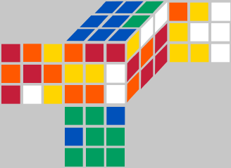

# 魔方还原-科先巴两阶段算法解读

## 概述

还原一个魔方, 就是将其从一个打乱的状态转变为还原状态.

本文介绍电脑还原魔方的一种方法, 即科先巴两阶段算法, 目前这种方法也被应用于人手动最小步还原DR(Domino reduction)中.

本文讨论的内容均已通过程序实现, 有兴趣可以查看: [frog-rubik-cube](https://github.com/FrogIf/frog-rubik-cube)

这里只介绍两阶段算法的总体思路, 不会涉及具体实现细节, 这篇文章读完之后, 完全无法开发一个基于两阶段算法的程序, 本文旨在介绍科先巴两阶段算法的主体思路, 这样当看具体实现相关的文章时, 大脑中已经有了一个地图, 不至于"迷路". 关于具体实现细节, 可以看科先巴两阶段算法: [Two-Phase Algorithm](http://kociemba.org/cube.htm). 我也将上面的大部分翻译为中文, 在这里: [两阶段算法(翻译)](https://github.com/FrogIf/frog-rubik-cube/blob/main/_doc/TheTwoPhaseAlgorithm.md).

另外, 本文的参考资料都在末尾[Reference](#reference)中列出.

> 本人魔方业余玩家, 曾经学过CFOP, 公式已经忘记的差不多了. 英文水平有限, 数学水平也有限, 魔方水平也有限, 认知水平也有限, 有不正确的地方, 希望多多指正, 可以在上面frog-rubik-cube中的issue中提出, 谢谢!

## 穷举

其实有一种简单粗暴的方式, 可以求解魔方的最小步. 就是穷举, 具体来说, 假设打乱后的状态为A, 还原状态为O. 然后, 我们有18元素的动作序列: ```R,R2,R',L,L2,L',U,U2,U',D,D2,D',F,F2,F',B,B2,B'```, 我们对A使用这个动作序列中的每一个动作, 就可以生成18个新的魔方状态, 检查这18个状态是否有与状态O匹配的. 如果有, 大功告成! 如果没有, 继续分别对这18个状态使用上面的18个动作, 这就得到了18\*18=324个状态, 再检查这324个状态, 如果还是没有与O匹配的, 就再分别对324状态使用18个动作, 得到324 \* 18 = 5832个状态, 就这样持续下去, 直到找到与O匹配的状态. 我们可以将这个过程表示为一颗树:


这种穷举的方式, 实际上是一种广度优先搜索. 一定可以找到最小步. 但是, 我们可以计算一下这棵树有多少个分支. 从第一层开始算:

```
1层: 18
2层: 18 * 18
3层: 18 * 18 * 18
4层: 18 * 18 * 18 * 18
...
20层: 18 ^ 20
```

所以, 这种方式进行穷举, 在第20层会有18^20=12748236216396078174437376个节点. 已经证明一个魔方的最小步不会超过20步([God's Number is 20](http://www.cube20.org/)), 所以, 最坏的情况下, 会有12748236216396078174437376个末端节点, 如果加上中间节点, 会有13498132464419376890580751=1.35e25个节点. 这是一个非常大的数字. 对于普通电脑来说, 这是不可能实现的.

## IDA*

实际上, 两阶段算法也是穷举, 就是对上面的穷举进行了大幅度的优化. 上面介绍的穷举是广度优先搜索, 两阶段算法中使用一种更合适的搜索算法--IDA\*. 关于IDA\*的详细介绍, 可以自行百度或者参考: [IDA\*](https://frogif.github.io/FrogNotebook/algorithm/ida_star.html). IDA\*算法可以简单理解为深度优先搜索+启发函数, 本身简短清晰, 实现起来很容易.

这里简单介绍一下IDA\*算法. IDA\*是有启发函数的迭代加深搜索.

* 首先, 它是一种深度优先搜索算法, 但是搜索的最大深度是变化的. 大致流程如下:

```
1. 指定最大搜索深度为1;
2. 执行深度优先搜索;
3. 没有找到目标;

4. 指定最大搜索深度为2;
5. 执行深度优先搜索;
6. 没有找到目标;

...

i. 指定最大搜索深度为n;
j. 执行深度优先搜索;
k. 找到了!
```

深度优先搜索沿着一条路径进行搜索, 对内存比较友好, 不像广度优先会存储大量的搜索节点信息.

* 其次, 它通过启发函数来选择搜索路径, 也就是说, 它并不是遍历所有可能的节点, 而是有选择性的挑选一些节点/分支进行搜索. 具体一点, 启发函数是用来预估魔方当前状态到目标状态大概还需要多少步. 得到这个预估的步数a之后, 加上已经走的步数b就得到了还原魔方的总步数预估值c=a+b. 然后, 通过c与当前指定的最大搜索深度进行比较, 如果超过了最大搜索深度, 则不搜索这个分支.

通过简单的IDA\*算法的介绍, 可以大致了解到, 这个算法效率的高低主要取决于启发函数, 如果启发函数选的好, 可以大规模的剪枝, 则可以很快的找到初始魔方状态到目标状态的路径.

两阶段算法中采用剪枝表作为启发函数, 输入一个魔方状态和一个目标状态, 这个函数通过查询剪枝表, 给出这两个状态之间的预估距离. 两阶段算法中, 这个启发函数给出的预估距离一定是小于等于真实距离的.(当然, 也可能存在哪些实现方式, 实现了大于真实距离的函数, 这时也可以得到还原步数, 只不过不是最短的) 启发函数给出的结果, 越接近真实值, IDA\*搜索执行的效率越高.

两阶段算法的核心是"两阶段", 主要工作实际上都集中在剪枝表的构建上, 目标都是构建尽可能小, 尽可能精确的剪枝表.

## 两阶段算法介绍

两阶段算法, 顾名思义, 分为两个阶段进行还原. 它不是直接将魔方还原, 而是先将魔方还原到一个中间状态, 然后再由中间状态还原. 这个中间状态是G1=<U,D,R2,L2,F2,B2>生成群, 就是由U,D,R2,L2,F2,B2这几个动作反复执行生成的状态.

这个中间状态有一个特点, 就是顶层和底层面的颜色只会是顶层或者底层的颜色. 如图是中间状态的一种情况:

 

两阶段算法先将魔方还原至中间状态G1, 再从G1还原.

这个中间状态有什么好处呢? 我们来算一笔账, 上面介绍穷举的时候, 我们已经知道, 从原始状态到还原状态, 需要搜索1.35e25个节点. 假如还是使用穷举, 但是, 这时加入一个中间状态--G1, 这个G1是一个模糊的状态集合, 只要符合规定特征的, 都属于这个状态, 所以, 从原始状态到这个目标状态集合的步数会减少很多, 实际上, 一阶段最多需要12步就可以达到中间状态, 所以在最坏的情况下, 搜索12步, 会搜索```18^1+18^2+18^3+18^4+18^5+18^6+18^7+18^8+18^9+18^10+18^11+18^12=1.22e15```个节点; 类似的, 从G1状态到达还原状态, 最多需要18步, 并且这一路径下只使用```U,U',U2,D,D',D2,R2,L2,F2,B2```这10个动作, 所以, 最坏情况下的搜索节点是:```10^1+10^2+10^3+10^4+10^5+10^6+10^7+10^8+10^9+10^10+10^11+10^12+10^13+10^14+10^15+10^16+10^17+10^18=1.11e18```. 所以两阶段合起来, 搜索节点为1.11e18个, 相较于直接从原始状态到目标状态1.35e25个节点, 少了7个数量级!

> 这种思想实际上是从thistlethwaite algorithm借鉴过来的. thistlethwaite algorithm是另一种计算机还原魔方算法.

虽然规模少了很多, 但是1.11e18也是一个相当大的数字. 这时, 就需要使用上面提到的IDA\*算法, 通过剪枝的方式缩减搜索的节点规模.

## 剪枝表

剪枝表的是用来预测当前状态到目标状态需要多少步的. 剪枝表中记录这每一个魔方状态到达目标状态的步数预估值. 具体来说, 对于阶段一, 就是记录任意状态到达G1状态的预估步数; 对于阶段二, 就是记录G1中的任意状态到达还原状态的预估步数. 这是怎么实现的呢? 穷举.

是的, 构建剪枝表使用的方式, 就是穷举. 拿阶段二来说, 就是从还原状态开始. 执行10个移动, 得到10个状态, 那么, 在剪枝表中, 就会记录这10个状态到目标状态的距离:1, 然后, 再对这10个状态分别应用10个移动, 得到新的100个状态, 将这100个状态距离目标状态的距离记为:2. 就这样不断执行下去, 这还是一个广度优先搜索, 搜索的深度是18. 阶段一也是同样的道理.

通过这种方式, 实际上遍历的节点个数就是上面计算出来的值1.11e18, 只不过是预先计算好了, 只需要执行一次, 以后多次进行搜索都不需要再重复计算, 拿来就用. 而且这个剪枝表中给出的都是精确值, IDA\*启发函数如果能得到精确值, 效率是最高的.

这样就结束了吗? 并没有, 1.11e18这个规模还是太大了, 接下来, 要减少剪枝表的空间占用. 具体措施有以下:

1. 将一个魔方状态拆分成多个不同的维度, 例如维度:a,b,c, 那么a,b,c都处于目标状态, 则整个魔方处于目标状态, 后面会详细介绍这样带来的效果;
2. 将魔方的状态使用简短的数字进行表示, 这样, 剪枝表中存储的就是数字x到目标状态的距离a, 存储数字而不是具体的状态会显著减小内存占用;
3. 利用魔方的对称性, 将不同的魔方状态合并视为同一状态, 一组对称的魔方状态到达目标状态的距离是相等的, 所以用一个状态表示就可以了;

下面, 依次介绍这些措施.

#### 朝向

为了接下来描述方便, 这里先详细介绍一下这个中间状态. G1中间状态的特点是所有顶层和底层的棱块和角块都位于顶层或底层, 并且所有棱块和角块的朝向都是正确的.

对于第一句"所有顶层和底层的棱块和角块都位于顶层或底层", 应该很好理解. 对于"所有棱块和角块的朝向都是正确的"则需要人为规定一种朝向. 这里的朝向定义是这样的, 如图, 阴影的位置为基准位置, 如果位于基准位置的面, 本来也是基准面上的, 那么这个块朝向正确, 否则朝向错误.


举个例子, 如下图, 棱块1朝向是正确的, 因为它的黄色面现在处于基准面上, 而该面在上图的状态中, 也是处于基准面上. 棱块2朝向是错误的, 因为它的蓝色面原来处于基准面上, 而现在它的黄色面处于基准面上.


#### 维度

将魔方状态拆分成多个不同的维度可以缩减魔方状态的规模. 上面我们了解了朝向的定义, 在描述一个魔方状态时, 我们就可以拆分为以下四个维度:

* 棱块位置
* 棱块朝向
* 角块位置
* 角块朝向

这四个维度复合在一起, 就完整的描述了一个魔方. 魔方的总状态数是:```8!*3^7*12!*2^11/2=43252003274489856000```, 而如果我们拆分为四个维度, 那么, 分别的状态数:

* 棱块位置: ```A(12,12)=12!```
* 棱块朝向: ```2^11```(不是```2^12```, 因为前11个确定下来之后, 第12个块也就确定下来了)
* 角块位置: ```A(8,8)=8!```
* 角块朝向: ```3^7```(不是```3^8```, 因为前7个角块朝向确定下来之后, 第8个角块的朝向也确定下来了)

那么, 我们描述的状态数就是```8!+3^7+12!+2^11=479046155```, 我们相当于把上面的乘法变成了加法, 规模显著减小.


#### 坐标

我们使用数字来描述魔方状态, 这样使得魔方状态的存储变小, 这个数字称为坐标.

试想一下, 假如不使用数字来表述魔方状态, 我们需要如何表述? 拿角块位置举例, 角块8个位置, 不妨将其称为:```URF, UFL, ULB, UBR, DFR, DLF, DBL, DRB```, 同时, 不妨将还原状态下URF上的角块就叫做URF, UFL上的角块就叫做UFL...以此类推, 所以, 一个打乱状态可以表示为: URF位置上是DRB块, UFL位置上是DBL块, ULB位置上是DLF块, UBR位置上是DFR块, DFR位置上是UBR块, DLF位置上是ULB块, DBL位置上是UFL块, DRB位置上是URF块. 用表格的方式表示如下:

位置|URF|UFL|ULB|UBR|DFR|DLF|DBL|DRB
-|-|-|-|-|-|-|-|-
块|DRB|DBL|DLF|DFR|UBR|ULB|UFL|URF

总之, 就是挺复杂的, 那么, 如果使用坐标的方式表示呢? 直接一个数字: 40319. 这个数字是这样算出来的:```1*1!+2*2!+3*3!+4*4!+5*5!+6*6!+7*7!```, 什么原理呢? 这里不做详细介绍, 可以看[这里](https://github.com/FrogIf/frog-rubik-cube/blob/main/_doc/TheTwoPhaseAlgorithm.md#%E8%A7%92%E5%9D%97%E7%BD%AE%E6%8D%A2%E5%9D%90%E6%A0%87%E5%AE%9A%E4%B9%89)

总之, 用一个数字就能完整的表示任何一个角块位置, 这个过程是可逆的, 也就是说, 通过上面的表格, 我们可以得到一个数字, 通过一个数字, 我们也可以得到上面的表格.

对于棱块位置, 棱块朝向, 角块朝向都有类似的坐标. 基本原理大致相同, 这里不做详细介绍, 可以看[科先巴两阶段算法](http://kociemba.org/cube.htm)中"The Coordinate Level"章节的描述, 或者翻译的[两阶段算法-坐标](https://github.com/FrogIf/frog-rubik-cube/blob/main/_doc/TheTwoPhaseAlgorithm.md#4-%E5%9D%90%E6%A0%87)

#### 对称

通过对称, 将不同的魔方状态合并视作同一个状态. 一组对称状态到达目标状态的距离是相等的. 这将大幅缩小剪枝表的尺寸. 科先巴两阶段算法中介绍了48种对称, 而两阶段算法中实际用到的是其中的16种. 关于对称的介绍, 比较复杂, 建议直接看详细的介绍:

* [科先巴两阶段算法](http://kociemba.org/cube.htm) 中的"Equivalent Cubes and Symmetry", "Coordinates and Symmetry"相关章节
* [翻译的版本](https://github.com/FrogIf/frog-rubik-cube/blob/main/_doc/TheTwoPhaseAlgorithm.md) 中"魔方的等价与对称","坐标和对称"章节

这里, 介绍一下对称所能达到的效果. 上面我们计算出了角块位置有8!=40320个不同的状态, 假设每16个是对称的一组, 则实际上就有8!/16=2520个状态(实际上是2768个状态, 具体原因科先巴两阶段算法中有解释). 那么, 假设这里我建立了一张剪枝表, 就有2520条记录, 这相当于2520个组, 每一组到达目标状态的距离是相等的.

这时, 我要查40319这个原始的角块位置坐标到达目标状态的距离, 我们首先通过某种方式, 确定40319这个原始坐标属于哪一个组, 然后查表就可以了.

所以, 这里我们可以看到, 我们将剪枝表的规模又除以了16.(实际中, 并不会缩减的这么多, 每一组中不一定有16个原始坐标)

上面, 说"通过某种方式"确定40319属于哪一个组, 具体是什么方式呢. 因为科先巴两阶段算法原文中对这里的介绍, 个人觉得不是很直观, 所以这里大致描述一下.

首先, 有2520个组, 每个组取一个代表, 放入一个数组中, 也就有了一个长度2520的数组, 其中的每个元素都是这个组的代表.

然后, 现在要确定40319这个坐标属于哪一个组, 因为组里的状态都是对称的, 所以, 我们就对40319这个状态应用16种对称, 得到了16个其他的状态, 这16个状态肯定有一个是上面那个代表的, 这样我们就确定了40319属于哪一个组.

## 剪枝表构建策略

上面已经知道了如何缩减剪枝表的规模, 那么, 剪枝表具体是如何构建的呢? 具体细节还是看科先巴两阶段算法的详细介绍吧. 这里主要说明在实际开发中的几点:

1. 剪枝表选取有多种不同的策略, 都能实现目的;
2. 每个阶段的剪枝表所给出的步数, 应该是魔方当前所关注的所有维度的状态复合, 到目标状态的步数;
3. 需要涉及到时空权衡, 越精确的剪枝表, 查询效率越高, 但是占用空间越大;
4. 拆分维度, 可以缩减规模, 拆分一张剪枝表为多张, 也可以缩减规模;
5. 有些坐标是不能单独作为原始坐标或者对称坐标出现在剪枝表中的.

接下来介绍一下剪枝表的构建策略, 可以构建多种不同的剪枝表, 只要能较好的给出预测, 并且覆盖所有的情况就行.

先看一下科先巴两阶段算法原文中给出的剪枝表:

剪枝表|对称坐标(y)|原始坐标(x)|表的映射个数|最大剪枝树深度
-|-|-|-|-
阶段1|FlipUDSlice(等价类个数64430)|角块朝向坐标(twist)(个数:2187)|140908410|12
阶段2|角块置换(CornerPermutation)(等价类:2768)|阶段二棱块置换坐标(Phase2EdgePermutation)(个数:40320)|111605760|18

看表映射个数列, 都在1亿以上, 还是挺大的.

下面这个表是陈霜大神的剪枝表方案:

```
	|  Pruning Table   |   Coord1  |Coord1 Size|  Coord2  | Coord2 Size  |   Phase   | Average |
	|:----------------:|:---------:|:---------:|:--------:|:------------:|:---------:|:-------:|
	| UDSliceTwistPrun |  UDSlice  |     495   | TwistSym |  2187 / 324  |     1     |   6.76  |
	|  UDSliceFlipPrun |  UDSlice  |     495   |  FlipSym |  2048 / 336  |     1     |   6.85  |
	|  TwistFlipPrun   |   Flip    |    2048   | TwistSym |  2187 / 324  |     1     |   7.18  |
	|    MCPermPrun    |   MPerm   |      24   | CPermSym | 40320 / 2768 |     2     |   9.69  |
	| EPermCCombPPrun  |   CComb   |     140   | EPermSym | 40320 / 2768 |     2     |   9.31  |
```

> 上面这个表格摘自: [min2phase](https://github.com/cs0x7f/min2phase/blob/master/Algorithm.md), 这个求解器现在已经集成到WCA官方程序中, 在比赛中, 用于打乱魔方.

这个规模就很小了, 但是, 实际上, 这个表中很多我都没看懂, 所以, 我也没有完全采用这种方案. 比如上面第二行的FlipSym和第三行的Flip. 科先巴两阶段算法中有提到棱块朝向坐标是不能应用对称的, 我写[程序](https://github.com/FrogIf/frog-rubik-cube/blob/main/test/symmetries_appliable.js)验证了一下, 也确实不能使用, 所以这里不理解是怎么使用的.

下面是我的剪枝表方案:

剪枝表|原始坐标|坐标数量|对称坐标|坐标数量|所属阶段|映射个数
-|-|-|-|-|-|-
FlipUDSlicePruningTable|x|x|FlipUDSlice|64430|1|64430
TwistUDSlicePruningTable|UdSlice|495|Twist|168|1|83160
CPermMPermPruningTable|MPerm|24|CPerm|2768|2|66432
EPermMPermPruningTable|MPerm|24|Phase2EPerm|2520|2|60480

1. UDSlice -- 棱块FR, FL, BL, BR位置, C(12,4)=495
2. Flip -- 棱块朝向, 2^11=2048
3. Twist -- 角块朝向, 3^7=2187
4. MPerm -- 中间层棱块位置, 4! = 24
5. CPerm -- 角块位置, 8!=40320
6. Phase2EPerm -- 顶层和底层棱块位置, 8!=40320

对于第一阶段, 我们要达到的目标是: 顶层和底层的棱块都位于顶层和底层, 所有棱块和角块朝向正确. 所以我们只需要关注Flip,Twist,UDSlice, 只要棱块FR, FL, BL, BR都位于中间层了, 那么"顶层和底层的棱块都位于顶层和底层"就满足了. 只要Flip,Twist正确了, "所有棱块和角块朝向正确"就满足了.

对于第二阶段, ```U,D,R2,L2,F2,B2```不会破坏块的朝向, 也不会把中间层的棱块移动到其他层. 所以, 我们不需要关注第一阶段的那些信息. 而是只需要关注: 中间层棱块位置, 角块位置, 顶层和底层棱块位置.

这个剪枝表怎么用呢, 以一阶段为例, 我们从当前魔方状态, 读取到角块朝向坐标, 棱块朝向坐标, 棱块FR, FL, BL, BR位置坐标, 从FlipUDSlicePruningTable查出一个值a, 从TwistUDSlicePruningTable查出一个值b, 然后, 我们取这两个值中的最大值作为预估值.


## Reference

* https://github.com/cs0x7f/min2phase
* http://kociemba.org/cube.htm
* https://github.com/hkociemba/CubeExplorer
* https://zhuanlan.zhihu.com/p/386717204


## 写在后面

上面只是简单的描述了两阶段算法的一些主要内容. 省略了亿点点细节. 例如:

1. 剪枝表步数如何存储, 使得空间利用率最高
2. 剪枝表中的对称坐标和原始坐标如何混合在一起
3. 移动表
4. 哪些坐标不能使用对称, 为什么
5. 通过搜索一阶段次优解, 寻找全局最优解