# 两阶段算法

## 0. 译序

内容来源自: http://kociemba.org/cube.htm, 出于版权方面考虑, 文中所有图片均重新绘制, 但是图片所要表示的内容均没有改变. 原文是英文, 翻译水平不高, 如有错误, 请指正, 谢谢! 以下内容为译文.

## 1. 前言

下面的文章尝试对[Cube Explorer](http://kociemba.org/cube.htm)中的数学思想和算法进行一些介绍. 

这个过程中我会面临很多问题, 首先, 英语不是我的母语, 所以, 文中的一些描述可能很难甚至无法理解; 其次, 我学习数学已经是很久之前的事了, 所以文章中使用的一些术语可能不准确; 此外, 我只能描述一些核心的思想, 以及编写Cube Explorer所需的内容.

但是, 我依然希望这篇文章会对"两阶段算法"感兴趣或者是想在自己的程序中实现两阶段算法的人有所帮助.

## 2. 置换与面

如果我们观察一个已经还原的魔方, 我们可以看到6*9个面.

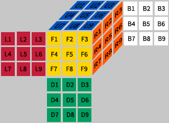

----

如果我们对这个魔方应用一个动作, 面将会被重新排序. 这样的一个重排序动作称为"置换".

我们用6个字母 -- U, R, F, D, B, L 来描述六个顺时针90°的旋转. 我们用形如F2来描述180°旋转, 用形如F'来描述270°(等价于逆时针旋转90°)旋转.

举个例子, 我们执行F动作, 会得到如下结果:

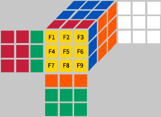

----

为了用程序表示这样一个置换, 我们现在只看黄色面. 这里给出了两种表达方式:

1. 移动表示法: F1移动到F3(F1 -> F3), F2 -> F6, F3 -> F9, F4 -> F2, F5 -> F5, F6 -> F8, F7 -> F1, F8 -> F4, F9 -> F7. 可以得到如下表:

F1|F2|F3|F4|F5|F6|F7|F8|F9
-|-|-|-|-|-|-|-|-
F3|F6|F9|F2|F5|F8|F1|F4|F7

2. 替换表示法: F1位置被F7替换(F1 <- F7), F2 <- F4, F3 <- F1, F4 <- F8, F5 <- F5, F6 <- F2, F7 <- F9, F8 <- F6, F9 <- F3. 可以得到如下表:

F1|F2|F3|F4|F5|F6|F7|F8|F9
-|-|-|-|-|-|-|-|-
F7|F4|F1|F8|F5|F2|F9|F6|F3

观察上面两个表格, 显然第一行一直都是固定的, 我们可以略去第一行, 所以可以简写为:

* 移动表示法: (F3,F6,F9,F2,F5,F8,F1,F4,F7)
* 替换表示法: (F7,F4,F1,F8,F5,F2,F9,F6,F3)

大多数情况下, 为了直观, 我们不会使用简写形式.

我们用第一种表示方式(移动表示法)来描述面级别的变换, 用第二种方式(替换表示法)表示块级别的变换. 这本章节的剩余部分, 将会使用移动表示法.

----

我们可以定义两个置换的乘积, 例如:

F1|F2|F3|F4|F5|F6|F7|F8|F9
-|-|-|-|-|-|-|-|-
F2|F1|F6|F3|F5|F4|F8|F7|F9

\*

F1|F2|F3|F4|F5|F6|F7|F8|F9
-|-|-|-|-|-|-|-|-
F3|F6|F9|F2|F5|F8|F1|F4|F7

=

F1|F2|F3|F4|F5|F6|F7|F8|F9
-|-|-|-|-|-|-|-|-
F6|F3|F8|F9|F5|F2|F4|F1|F7

> 第一个置换使得 F1 -> F2, 接下来, 第二个置换使得F2 -> F6, 所以两个复合起来, 就是F1 -> F6.

----

置换的乘法与自然数的乘法很相似, 但是, 这里有一个很大的不同之处: 对于自然数的乘法, 3\*5 = 5\*3, 但是对于置换的乘法, 是不满足交换律的:

F1|F2|F3|F4|F5|F6|F7|F8|F9
-|-|-|-|-|-|-|-|-
F3|F6|F9|F2|F5|F8|F1|F4|F7

\*

F1|F2|F3|F4|F5|F6|F7|F8|F9
-|-|-|-|-|-|-|-|-
F2|F1|F6|F3|F5|F4|F8|F7|F9

=

F1|F2|F3|F4|F5|F6|F7|F8|F9
-|-|-|-|-|-|-|-|-
F6|F4|F9|F1|F5|F7|F2|F3|F8

----

还有一个重要的概念, 叫做"逆置换".

观察如下F的置换表示:

F1|F2|F3|F4|F5|F6|F7|F8|F9
-|-|-|-|-|-|-|-|-
F3|F6|F9|F2|F5|F8|F1|F4|F7

以及另一个置换表示:

F1|F2|F3|F4|F5|F6|F7|F8|F9
-|-|-|-|-|-|-|-|-
F7|F4|F1|F8|F5|F2|F9|F6|F3

这两个置换相乘的结果是:

F1|F2|F3|F4|F5|F6|F7|F8|F9
-|-|-|-|-|-|-|-|-
F1|F2|F3|F4|F5|F6|F7|F8|F9

这个结果代表着, 什么都不做. 所以当我们用一个置换乘以它的逆置换时, 就会得到"单位置换"(用I表示). 实际上, 在这个例子中, 第二个置换就是F', 所以我们有 F \* F' = I.

你可以尝试一下, 在这种情况下, F' \* F = I也是成立的, 所以在这种情况下, 乘法满足交换律.

----

在[CubeDefs.htm](http://kociemba.org/math/CubeDefs.htm#faceturns), 你可以看到每一个基本移动的完整定义. 例如:

F = (U1,U2,U3,U4,U5,U6,R1,R4,R7,D3,R2,R3,D2,R5,R6,D1,R8,R9,F3,F6,F9,F2,F5,F8,F1,F4,F7,L3,L6,L9,D4,D5,D6,D7,D8,D9,L1,L2,U9,L4,L5,U8,L7,L8,U7,B1,B2,B3,B4,B5,B6,B7,B8,B9)

> 这里采用的是简写形式

不仅仅移动的动作可以视作是一个个的置换, 每一个打乱的魔方状态也可以看做是置换. 如图:

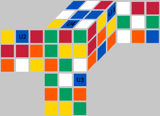

从图中可以看出, U1 -> R3, U2 -> L2, U3 -> D3, U4 -> U8, ... , 这个魔方可以表示为: (R3, L2, D3, U8, ...).

当你求解一个魔方时, 实际上, 就是求出一连串基本置换的乘积得到的魔方当前状态的置换的逆置换. 置换乘以逆置换得到单位置换, 这就还原了魔方. Cube Explorer的求解算法就是尝试寻找最短的这个逆置换乘积, 例如图上的状态, 可以在几秒钟, 找到它的逆置换:

```
R2*L*U2*L2*D*R2*U2*L'*D2*R'*U*B*R'*F2*L2*B2*L2*B2
```

但是, 单纯从面级别来表示一个魔方, 还不能高效的还原一个魔方, 这里还有另外的两个级别.

## 3. 块

在块级别上, 我们要描述的置换对象不再是面, 而是针对12个棱块和8个角块.

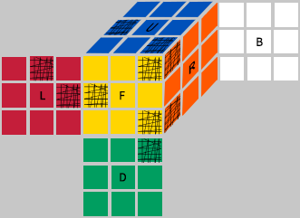

上图中, 标记了UFR角块, DFR角块, FL棱块, UL棱块. 类似地, 角块被命名为: URF, UFL, ULB, UBR, DFR, DLF, DBL, DRB; 棱块命名为: UR, UF, UL, UB, DR, DF, DL, DB, FR, FL, BL, BR.

----

在块级别上, 不能通过简单的置换来描述一个移动或者一个打乱状态, 因为角块可以扭转, 棱块可以翻转.

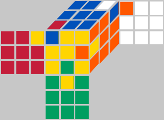

如图, 块都处在它原有位置, 但是朝向发生了变化. UFL角块发生了顺时针扭转, UBR角块发生了逆时针扭转, DF棱块和FR棱块都被翻转了.

----

如果棱块或者角块不在它原始位置, 可以有很多种方式定义块的朝向. 但是对于两阶段算法, 下面的定义方式是必须的:

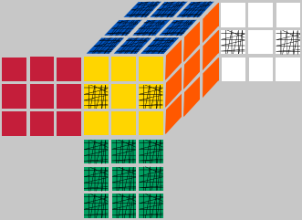

图中魔方处于还原状态, 有几个面被特殊标记了, 这是用来作为参考朝向的. 如果一个块移动到非原始位置, 该块的参考面与还原状态的一个参考面重合, 我们就定义这个块的朝向为0, 否则, 对于棱块, 就定义朝向为1, 这时我们称这个棱块处于翻转状态; 另外, 角块参考面没有与原始状态的参考面重合, 我们就定义1(顺指针扭转)或者2(逆时针扭转).

在参考框架下, 如果所有棱块和角块的朝向都是0, 这时, 在所有的18中移动方式中, 存在10种移动不会改变棱块和角块的朝向. 这一性质是求解算法的关键.

> 译注: 这10种移动是: F2, R2, L2, B2, U, D, U2, U', D2, D'

----

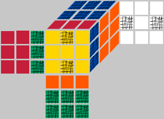

上图中, 魔方经过了一次F移动, 在URF位置处的角块相对于还原状态下的参考面发生了顺时针扭转, 类似的, DLF位置处的角块和DFR位置处的角块发生了逆时针旋转. 位于UF, DF, FR位置处的棱块发生了翻转.

我们使用"替换表示法"表示块级别的置换. 对于上面的例子: URF被UFL替换(URF <- UFL), UFL‹-DLF, ULB ‹-ULB, UBR‹-UBR, DFR‹-URF, DLF‹-DFR, DBL ‹-DBL, DRB‹-DRB. 如下表:

URL|UFL|ULB|UBR|DFR|DLF|DBL|DRB
-|-|-|-|-|-|-|-
UFL|DLF|ULB|UBR|URF|DFR|DBL|DRB

同时, 我们也需要保留朝向变化的信息, 所以上表需要调整为:

URL|UFL|ULB|UBR|DFR|DLF|DBL|DRB
-|-|-|-|-|-|-|-
c:UFL;o:1|c:DLF;o:2|c:ULB;o:0|c:UBR;o:0|c:URF;o:2|c:DFR;o:1|c:DBL;o:0|c:DRB,o:0

没有扭转, 用0表示; 顺时针扭转, 用1表示; 逆时针扭转用2表示. 通过这种方式, 我们可以很轻松的表示两个朝向相加. 例如, 我们执行两个逆时针扭转, 结果是2 + 2 = 4, 因为 4 ≡ 1 mod 3, 所以结果是顺时针扭转. 在[CubeDefs.htm](http://kociemba.org/math/CubeDefs.htm#cornfaceturns)中对于基本移动有相关的定义.

对于棱的置换定义也是类似的, 翻转用1表示, 未翻转用0表示.

----

我们需要一个记号来描述置换用来替代上面的表格. 对于上面的F移动, 可以写作:

```
F(URF).c = UFL
F(URF).o = 1
F(UFL).c = DLF
F(UFL).o = 2
...
```

----

接下来, 引入R移动来展示F*R是如何工作的.

R = 

URF|UFL|ULB|UBR|DFR|DLF|DBL|DRB
-|-|-|-|-|-|-|-
c:DFR;o:2|c:UFL;o:0|c:ULB;o:0|c:URF;o:1|c:DRB;o:1|c:DLF;o:0|c:DBL;o:0|c:UBR,o:2

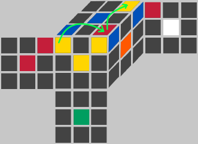

> 上图是F\*R动作应用到UFL角块上的效果的示意

F动作中F(URF).c = UFL, F(URF).o = 1, 这告诉我们URF位置处的角块会被UFL位置的角块替换掉, 同时移动到URF位置的角块朝向会增加1;

R动作中R(UBR).c = URF, R(UBR).o = 1, 这告诉我们UBR位置处的角块会被URF位置的角块替换掉, 同时移动到UBR位置的角块朝向会增加1.

所以, 当执行F\*R复合动作时, 我们有URF <- UFL, 然后, UBR <- URF. 最终结果是: UBR <- UFL. 这里可以表示为(F\*R)(UBR).c = UFL, 这个表达式的意思是: (F\*R)(UBR).c = F(R(UBR).c).c;

角块朝向的变化不太容易理解. F指示F(URF).o = 1对于URF <- UFL, 意思是, 从UFL位置移动到URF位置的角块, 朝向会增加1. 然后, R移动会导致由URF移动到UBR位置的角块朝向也发生变化, 对于最终移动到UBR位置的角块, 这两个移动的复合变化是F(URF).o+R(UBR).o, 又由于URF = R(UBR).c, 代入之后, 得到: (F\*R)(UBR).o = F(R(UBR).c).o + R(UBR).o.

----

综上, 可以得出形式化的结论, 对于置换A, B, 对于任意位置x处的角块, 我们有:

(A\*B)(x).c = A(B(x).c).c

(A\*B)(x).o = A(B(x).c).o + B(x).o

同样的原则, 对于棱块也适用. 参考[CubeDefs.htm](http://kociemba.org/math/CubeDefs.htm#cornmult)中对于乘法的实现.

当我们需要利用魔方对称的特点时, 我们还需要考虑到动作的镜像的情况, 这时事情会变得有点复杂. 上面描述的对3取余可以理解为C3循环群中的运算, 如果需要考虑镜像的情况, 我们需要使用二面群D3. 这时, 我们引入三个新的数字3, 4, 5来描述.

## 4. 坐标

从坐标层面, 可以通过自然数来描述角块和棱块的置换及朝向. 这一层抽象对于一个快速的魔方求解算法尤其合适.

----

##### 角块朝向坐标定义

如果我们对于一个还原了的魔方应用R移动, 会得到:

URF|UFL|ULB|UBR|DFR|DLF|DBL|DRB
-|-|-|-|-|-|-|-
c:DFR;o:2|c:UFL;o:0|c:ULB;o:0|c:URF;o:1|c:DRB;o:1|c:DLF;o:0|c:DBL;o:0|c:UBR,o:2

这8个角块的朝向可以通过[0, 3^7-1]范围内的数字来描述.

在```cubicube.pas```, 你可以找到下列定义:

```
function CubieCube.CornOriCoord:Word;
var co: Corner; s: Word;
begin
  s:=0;
  for co:= URF to Pred(DRB) do s:= 3*s + PCorn^[co].o;
  Result:= s;
end;
```

举个例子来说明这段程序的效果, 对于上面的R移动, 通过这段程序, 可以计算为:

```
2*3^6 + 0*3^5 + 0*3^4 + 1*3^3 +1*3^2 + 0*3^1 + 0*3^0 = 1494
```

> 三进制转十进制

上面这段代码, 只适用于"替换表示法", 不适用于"移动表示法".

上面可以发现, 我们忽略了DRB角块的朝向, 因为这个角块的朝向完全由另外7个角块的朝向确定了 -- 所有角块朝向的和一定可以被3整除.

----

##### 棱块朝向坐标定义

棱块朝向坐标的定义与角块类似.

12个棱块的朝向可以通过[0, 2^11-1]范围内的数字描述.

在```cubicube.pas```, 你可以找到下面的定义:

```
function CubieCube.EdgeOriCoord:Word;
var ed: Edge; s: Word;
begin
  s:=0;
  for ed:= UR to Pred(BR) do s:= 2*s + PEdge^[ed].o;
  Result:= s;
end;
```

```
译注:
对于R, 形式化的演示一下:
R(x10).o * 2^10 + R(x9).o * 2^9 + ... + R(x0).o * 2^0
```

这里我们使用的是二进制系统. 我们忽略BR棱的朝向, 因为这个棱的朝向完全由另外11条棱决定 -- 所有棱块朝向之和一定是偶数.

----

##### 角块置换坐标定义

角块的置换坐标可以通过[0, 8! - 1]范围内的数字定义.

下面我们以R移动为例, 暂时忽略朝向:

URF|UFL|ULB|UBR|DFR|DLF|DBL|DRB
-|-|-|-|-|-|-|-
c:DFR|c:UFL|c:ULB|c:URF|c:DRB|c:DLF|c:DBL|c:UBR
||1|1|3|0|1|1|4

首先, 我们定义角块的自然顺序: URF<UFL<ULB<UBR<DFR<DLF<DBL<DRB.

针对某一个角块XXX(第二行), XXX下面第三行的数字, 代表所有它左侧的角块中, 按照自然顺序不应该在它左侧的.

例如, 对于UBR角块, 它左侧总共有7个角块, 其中按照上面规定的顺序, 不应该出现在它左侧的角块有4个, 所以它下面的数字是4. 同样, 对于DLF角块, 它左侧共有5个角块, 按照上面规定的顺序, 不应该出现在它左侧的角块有1个, 所以它下面的数字是1.

我们用表格第三行的这些数字, 构建置换的坐标:

```
1 * 1! + 1 * 2! + 3 * 3! + 0 * 4! + 1 * 5! + 1 * 6! + 4 * 7! = 21021
```

> 这里采用的是"variable base"(译注: 康托展开 或 Factorial number system, 参见[康托展开](https://frogif.github.io/FrogNotebook/algorithm/cantor_expansion.html) 或 [Factorial number system](https://en.wikipedia.org/wiki/Factorial_number_system))

下面是cubicube.pas中的具体实现代码:

```
function CubieCube.CornPermCoord: Word;
var i,j: Corner; x,s: Integer;
begin
  x:= 0;
  for i:= DRB downto Succ(URF) do
  begin
    s:=0;
    for j:= Pred(i) downto URF do
    begin
      if PCorn^[j].c>PCorn^[i].c then Inc(s);
    end;
    x:= (x+s)*Ord(i);
  end;
  Result:=x;
end;
```

----

##### 棱块置换坐标定义

棱块置换坐标用类似的方式描述, 其数字范围是[0, 12! - 1].

下面是cubicube.pas中的具体实现代码:

```
function CubieCube.EdgePermCoord: Integer;
var i,j: Edge; x,s: Integer;
begin
  x:= 0;
  for i:= BR downto Succ(UR) do
  begin
  s:=0;
  for j:= Pred(i) downto UR do
  begin
    if PEdge^[j].e>PEdge^[i].e then Inc(s);
  end;
  x:= (x+s)*Ord(i);
  end;
  Result:=x;
end
```

----

现在我们可以使用元组来描述一个完整的魔方了. 元组的形式为: ```(x1, x2, x3, x4)```, 对应上面:

```
0 <= x1 < 3^7
0 <= x2< 2^11
0 <= x3< 8!
0 <= x4< 12!
```

这些范围的魔方中, 只有一半是真实可能出现的, 因为实际可以到达的置换坐标只能是偶数, 所以只有```12! * 8! / 2```个置换(忽略朝向). 

所以可能出现的魔方状态总共有:

```
3^7 * 2 ^ 11 * 8! * 12! / 2 = 43252003274489856000
```

> 这里还有一些其他的坐标会在"两阶段算法"中出现, 我们稍后介绍.

## 5. 魔方的等价与对称

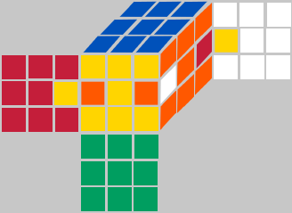 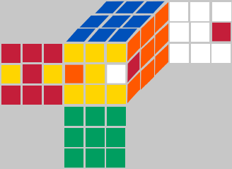

观察上图的两个魔方. 他们看起来是不同的, 但是基本结构是相同的. 如果你将左图中的魔方整体绕U和D的中心所确定的轴旋转90°, 你会得到:

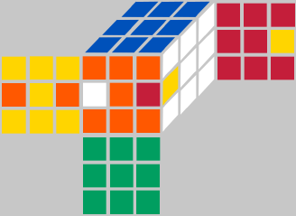

> 这个魔方, 如果你重新给魔方上色, 使得F面变为红色, 其他颜色也相对变化, 这时候, 就得到了右图. 这时, 我们称这两个魔方是等价的.

**由于等价的魔方具有相同的结构, 还原它们所需要的步也是相同的.**

----

通过给魔方重新上色来定义等价块并不是我们想要的, 因为这样是基于面级别来定义的. 我们更倾向于从块的置换级别来定义等价. 用S\_U4表示以U和D中心为轴, 旋转整个魔方90°. 然后, 用A表示左图魔方的置换, 用B表示右图魔方的置换. 则我们有:

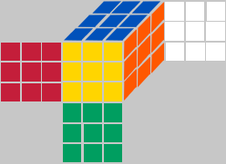|S\_U4^-1|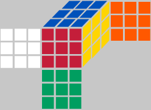|A|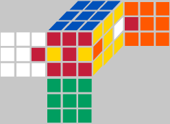|S\_U4|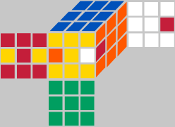
-|-|-|-|-|-|-


所以我们有```B=S_U4^-1 * A * S_U4```. 一般地, 两个魔方置换A和B如果是等价的, 需要满足下面这个条件:

```
B = S^-1 * A * S
```

----

对于每一个魔方状态, 有48种等价的状态, 因为一个魔方有48中对称方式(包括镜像对称). 在CubeExplorer中, 这48个对称方式可以由四种基本的对称方式生成:

* S\_URF3: 以URF块和DBL块连线为轴, 旋转120°;
* S\_F2: 以F和B面中心为轴, 旋转180°;
* S\_U4: 以U和D面中心为轴, 旋转90°;(译注: 右手定则, 法线方向向下)
* S\_LR2: 以R和L所夹面做镜像对称.

这些基本的对称在cubedefs.htm中均有描述: [角块的置换](http://kociemba.org/math/CubeDefs.htm#cornsym), [棱块的置换](http://kociemba.org/math/CubeDefs.htm#edgesym)

48中对称方式都可以通过下面的乘法复合生成:

```
(S_URF3)^(x1) * (S_F2)^(x2) * (S_U4)^(x3) * (S_LR2)^(x4)
```

其中, x1的取值范围是:[0,2], x2的取值范围是:[0,1], x3的取值范围是:[0,3], x4的取值范围是[0,1]. 这个元组(x1, x2, x3, x4)可以映射到一个[0,47]的自然数:

```
16 * x1 + 8 * x2 + 2 * x3 + x4
```

通过这种方式, [0, 47]的索引可以关联到每一个对称. 所以, 我们用S(i)来表示一个对称.

两个魔方的置换A和B等价当且仅当满足下面的式子:

```
S(i)^-1 * A * S(i) = B
```

所有等价的魔方属于同一个等价类. 在CubeExplorer中, S(i)通过CronSym和EdgeSym数组来实现, 详见symmetries.pas.

```
译注:
这里可以不严谨的证明一下B = S(i)^-1 * A * S(i)是等价关系.
首先重新描述一下这个等价关系: 
基于四种基本对称S_URF3, S_F2, S_U4, S_LR2以及上面定义的对称乘法运算, 可以构建一个有限生成群, 这个有限生成群的阶就是48. 不妨我们就将这48个元素构成的集合称为SYM
那么这个等价关系就可以表述为: 如果两个置换存在B = S^-1 * A * S, 其中S属于SYM, 则A,B等价. 证明过程如下:
1. 反身性: 显然如果S是SYM的单位元, 则A = S^-1 * A * S, 所以反身性成立;
2. 对称性: 如果B = S1^-1 * A * S1, 由于群中的每一个元素都存在逆元, 显然S2=S1^-1也属于SYM, 使得A = S2^-1 * B * S2成立, 所以对称性成立;
3. 传递性: 显然B = S1^-1 * A * S1, C = S2^-1 * B * S2, 可以推出C = S2^-1 * S1^-1 * A * S1 * S2 = (S1 * S2)^-1 * A * S1 * S2, 根据群的封闭性, 存在S3=S1 * S2属于SYM, 使得C=S3^-1 * A * S3成立, 所以传递性成立;
证毕.
```

## 6. 从数学角度看坐标 -- 陪集

群G和它的子群H, 对于G中的每一个元素g, 有集合{h \* g | h \in H, g \in G}称为H的右陪集.

每一个打乱的魔方可以视为一个带有朝向的置换. 所有这些置换构成了群G.

CubeExplorer中使用到的坐标可以对应到右陪集上, 其中不同的坐标类型下, 子群H是不同的.

G的子群|坐标|使用场景
-|-|-
所有角块朝向为0的置换构成群|角块朝向坐标(twist)[0, 2186]|阶段一;解优化
所有棱块朝向为0的置换构成群|棱块朝向坐标(flip)[0, 2047]|阶段一;解优化
所有UD中间层的棱位于中间层构成群|UD层坐标(UDSlice)[0, 494]|阶段一;解优化
所有棱块朝向为0并且UD中间层的棱位于中间层|翻转UD层坐标范围(FlipUDSlice)[0, 495 * 2048 - 1]|一阶段;标准解优化
所有角块位于正确的位置任意的朝向的置换构成群|角块置换坐标(CornerPermutation)[0, 40319]|阶段二;解优化
所有U和D面的8个棱块位于正确的位置任意朝向的置换构成群|阶段二棱块置换坐标(Phase2EdgePermutation)[0, 40319]|阶段二
所有UD中间层棱块位于正确位置任意朝向的置换构成群|阶段二有序坐标(UDSliceSorted)[0, 11879]|阶段二;解优化

```
译注:
1. 上表中, 陪集最后的括号是我加的, 就是给陪集增加一个标记, 方便下文中引用

2. 上表中, 坐标列, 每个后面都跟着一个取值范围, 这个暂时可以忽略, 我先给出解释, 后期再回来看就好了, 这个是坐标的取值范围, 拿第一行为例, 通过下面的结论会知道, 角块朝向相同的置换属于同一个陪集, 所以, 有多少中不同的角块朝向, 就会有多少个陪集, 而通过前面的章节, 我们知道, 角块朝向坐标的取值范围是[0, 2186], 所以陪集的个数也就是2186+1=2187, 所以坐标的取值范围也就是[0, 2186]

3. 下面列出了表中不同坐标取值范围的计算方式:
twist - 所有角块朝向情况 - 3^7=2187
flip - 所有棱块朝向情况 - 2^11=2048
UDSlice - UD中间层四个位置的棱块的所有情况 - C(12, 4) = 12 * 11 * 10 * 9 / 4! = 495
FlipUDSlice - UD中间层四个位置的棱块的所有情况+所有棱块朝向(上面flip和UDSlice的复合) - C(12, 4) * (2 ^ 11) = 495 * 2048 = 1013760
CornerPermutation - 所有角块位置情况 - 8! = 40320
Phase2EdgePermutation - U层和D层8个棱块只在U和D层的情况 - 8! = 40320
UDSliceSorted - UD中间层四个棱块的所有情况含顺序 - A(12, 4) = 12 * 11 * 10 * 9 = 11880

4. 表中"FilpUDSlice"取值范围原文写的是"494*2048-1"应该是写错了;

5. 证明上表中第一条"所有角块朝向为0的置换构成G的一个子群C0"
证明:
1. 对于G, 单位元是还原状态的置换e, 此时所有角块朝向均为0, 因此e属于C0;
2. 假设a属于C0, b属于C0, 则a和b的复合运算为:(a*b)(x).o = a(b(x).c).o + B(x).o = 0, 所以 a * b属于C0
3. 假设a属于C0, a的逆置换为a^-1, 有a * a ^ -1 = e, 即(a*a^-1)(x).o = a(a^-1(x).c).o + (a^-1)(x).o = 0, 显然a^-1(x).o = 0, 所以a^-1属于C0
综上C0是G的一个子群
```

实际使用过程中, 上面的一些坐标可以通过对称来缩减规模, 这一点将会在下一节中讨论.

----

举个例子, 使用角块朝向坐标定义的子群C0:

```
C0 = {g \in G | g(x).o = 0, \forall 角块}
```

在这种情况下, 有陪集的定义如下:

```
C0 * g = {a * g | a \in C0}
```

对于C0中的每一个元素, 都有G中的元素g, 对于其中的角块, 有:

```
(a * g)(x).o = a(g(x).c).o + g(x).o = 0 + g(x).o = g(x).o
```

因此, C0 \* g不会改变g的角块朝向, C0 \* g得到一个集合, 而这个集合中所有元素的角块朝向坐标都相同, 都等于g的角块朝向坐标([角块朝向坐标定义](#角块朝向坐标定义)). 反过来说, 如果两个置换具有相同的角块朝向坐标, 则它们属于同一个陪集(证明略). 所以, 在角块朝向坐标和C0所定义的陪集之间存在一一映射.

```
译注, 对上面一段话的解释:
对于全体魔方置换群G;
G中的一个元素g, C0对于该元素的右陪集是C0 * g
G中的另一个元素g', C0对于该元素的右陪集是C0 * g'
若, 对于任意x, (a * g)(x).o == (a * g')(x).o, 则C0 * g 与 C0 * g'是同一个右陪集
即, 若g 和 g' 的角块朝向坐标相同, 则g和g'属于同一个右陪集
```


> 译注:
> 对这节进行一下总结, 题目叫"从数学角度看坐标--陪集". 上面我们知道了, 我们在记录一个魔方状态的时, 并不是直接描述一个魔方的每一个块的位置和朝向, 而是将一个魔方状态拆分为: 角块朝向, 棱块朝向, 角块位置, 棱块位置这四个维度. 以角块朝向为例, 同一个角块朝向下, 显然有多种不同的棱块朝向,角块位置以及棱块位置, 这时, 同一个角块朝向下的不同的棱块朝向+棱块位置+角块位置就构成了一个陪集. 也可以说, 一个坐标就代表一个陪集.

## 7. 坐标和对称

通过上面可知坐标和陪集之间存在一一映射, 所以可以通过一个坐标来表示一个陪集, 即使这个陪集中存在很多个元素.

如果你整体移动魔方并重新上色, 或者使用上面介绍的对称S(i), 这个坐标将会改变.

如果你想使用对称将一个坐标变换为另一个坐标, 要格外小心. 如果你有两个不同的置换P和Q在同一个陪集中, ```S(i) ^ -1 * P * S(i)```和```S(i)^-1 * Q * S(i)```也需要在同一个陪集中, 否则就不能做这个变换, 也不能定义等价的陪集.

> 译注: 因为一个坐标代表一个陪集, 这里假设是角块朝向坐标, 那么一个角块朝向坐标, 实际代表了很多个不同的魔方状态, 它们的棱块朝向,棱块位置,角块位置都不相同. 假设有坐标x, 以及这个坐标x所代表的两个置换A和B; x通过对称变换S得到坐标y, 然后A通过对称变换S得到A', B通过对称变换S得到B'; 如果时A所对应的坐标a和B所对应的坐标b以及y之间不相等, 那么这个坐标就失去了作用了, 程序就出错了.

这限制了适用于坐标的对称. 要证明对称变换S(i)对于某个坐标是否适用并不难, 对于用来定义陪集的子群H, 需要满足这个性质: ```S(i)^-1 * H * S(H) = H```

----

##### 对称表

下面的表格列出了哪一个对称变换适用于哪一个坐标, 以及在哪里用到了.

坐标|所有48个元素的对称群|通过S\_F2,S\_U4,S\_LR2生成的16个元素的子群|应用场景
-|-|-|-
角块朝向(twist)|×|√|阶段1;解优化
棱块朝向(flip)|×[1]|×[1]|----
UD中间层(UDSlice)|×|√|----
翻转UD中间层(FlipUDSlice)|×|√|阶段1;解优化;64430等价类
角块置换(CornerPermutation)|√[2]|√|阶段2;2768等价类
阶段2棱置换(Phase2EdgePermutation)|×|√|阶段2
UD中间层有序坐标(UDSliceSorted)|×|√|最优解;788等价类

> [1] -- 对于棱块的方向, 可以给出另一种定义, 使得含有48个元素的完整对称群可以适用于棱块朝向坐标. 但是我们更偏向于所有的坐标采用一致的定义, 这对于两阶段算法更合适.
> [2] -- 在Cube Explorer中没有使用.

> 译注: 坐标后面的括号中的标记, 是我加的, 对应上一节中的子群的表

----

对于FlipUDSlice, CornerPermutation, UDSliceSorted这三个类型的坐标, 等价类的数量在上表中已经给出.

```
译注: 对这里突然就冒出的等价类给出解释.
首先, 前面我们有了等价关系和等价类的定义. 首先要说明的, 对于S_F2,S_U4,S_LR2生成的16个元素的子群, B = S^-1 * A * S依旧是等价关系.
那么上面表格中, 陪集中的元素上, 就可以根据它们后面的对称群, 被划归到不同的等价类中去. 
同一个等价类中的所有元素可以视为对称的, 不同等价类中的元素无法通过对称变换进行转换.
```

例如, 对于FlipUDSlice坐标, 坐标的范围是[0, 495\*2048-1]. 但是对称应用到这1013760个坐标, 会将这些坐标映射到64430个等价类中.

> 译注: 这个64430应该是程序通过穷举统计出来的.

每个等价类最多有16个坐标(之所以是16个而不是48个, 是因为我们只使用保持UD轴不变的对称). 对于每一个等价类, 我们存储最小的坐标作为这个等价类的代表元, 并将其存放在长度64430的整形数组. 通常的, 我们称这个数组为**ClassIndexToRepresentantArray**(等价类索引到代表元的映射的数组).

这样, 旧的坐标x就可以替换为新的坐标```16 * y + i```. 其中y表示等价类的索引, 取值范围是[0, 64429], i是对称变换的索引, 取值范围是[0, 15], S(i)应用到这个等价类的代表元上就可以得到x. 为了在文中区分旧坐标和新坐标, 我们称旧坐标为原始坐标(raw-coorinate), 称新坐标为对称坐标(sym-coordinate).

FlipUDSlice的对称坐标有64430 \* 16 = 1030880个不同的值, 超出FlipUDSlice陪集中元素个数495 \* 2048 = 1013760(译注: 也就是原始坐标个数). 这是因为, 对于一些拥有对称性的魔方状态, 在一个等价类中对应的原始坐标小于16个, 不同的对称变换应用到这个原始坐标上去, 得到的对称坐标是相同的, 即16\*y+i1 和16\*y+i2描述的是同一个原始坐标x.

> 译注: 对称坐标到底是啥? 对称坐标就是```16 * y + i```, 上面有ClassIndexToRepresentantArray, 这个数组的索引就是y, 这个数组每个索引位置存储的值是原始坐标! 也就是等价类的代表元. 可以把对称坐标表示为(y, i)一个数对, 而原始坐标只是一个值, 而且我们不存储对称坐标. 对称坐标总共有1030880, 这1030880个对称坐标与ClassIndexToRepresentantArray的索引上存在多对一的映射, 通过索引y又能取到等价类代表元(原始坐标)x, 然后通过S(i), 又能找到原始坐标, 所以ClassIndexToRepresentantArray与1013760个原始坐标之间相当于存在一对多的映射.

## 8. 两阶段算法坐标

如果转一个还原的魔方, 并且不能使用R, R', L, L', B, B', 那么将会生成所有魔方状态的一个子集, 这个子集可以标记为:G1 = <U, D, R2, L2, F2, B2>

一个这个子集G1下的例子:

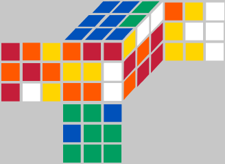

在这个子集中, 所有棱块和角块的朝向都为0, 本属于UDSlice上的四个棱块均位于UDSlice.

反过来, 如果所有棱块和角块朝向都为0, 并且所有属于UDSlice上的棱块都位于UDSlice上, 那么, 这个魔方状态就属于G1.

----

两阶段算法解魔方分两步: 在阶段一, 算法要寻找可以还原到G1状态的路径; 在阶段二, 从G1状态开始还原整个魔方.

在一阶段, 将会有很多种不同的路径都可以将打乱状态还原至G1状态. 两阶段算法将尝试不同的一阶段路径, 从而找到尽可能短的整体解决方案.

----

在阶段一, 任何一个魔方状态都可以描述为以下三个坐标:

* [角块朝向坐标](#角块朝向坐标定义)[0, 2186]
* [棱块朝向坐标](#棱块朝向坐标定义)[0, 2047]
* UDSlice坐标

##### 关于UDSlice坐标

对于UDSlice坐标, 其坐标的取值范围是:[0, 12 * 11 * 10 * 9 / 4! - 1 = 494], 这是由4个UD中间层棱块位置决定的. 这4个棱块的位置顺序可以忽略.

> 译注: 12 * 11 * 10 * 9 / 4! 就是这4个棱块的组合数C(12, 4), 这里关注的是FL,FR,BR,BL这四个棱块所在位置, 而不是中间层的4个位置是哪些棱块.

我们以F移动为例:

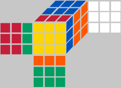|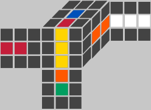|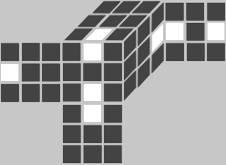
-|-|-
F移动|UDSlice的棱块|忽略顺序

下面的函数来自于cubicube.pas, 实现了UDSlice坐标的运算. 这段代码不是很好理解, 详细的解释, 参考这里: [here](#UDSlice坐标). C(n,k)是组合数:

```
function CubieCube.UDSliceCoord;
var s: Word; k,n: Integer; occupied: array[0..11] of boolean; ed: Edge;
begin
  for n:= 0 to 11 do occupied[n]:=false;
  for ed:=UR to BR do if PEdge^[ed].e >= FR then occupied[Word(ed)]:=true;
  s:=0; k:=3; n:=11;
  while k>= 0 do
  begin
    if occupied[n] then Dec(k)
    else s:= s + C(n,k);
    Dec(n);
    end;
  Result:= s;
end;
```

所以, 阶段一的每个魔方状态都可以用一个元组来表示(x1, x2, x3), 当且仅当魔方状态处于G1中时, 这个元组的值为(0, 0, 0). 阶段一的问题空间有2187\*2048\*495 = 2217093120种不同的状态.

----

在阶段二, 任何一个魔方状态也可以被3个坐标描述:

* [角块置换坐标](#角块置换坐标定义)
* 阶段二棱块置换坐标
* 阶段二UDSlice坐标

在阶段二, 元组(0, 0, 0)属于还原状态.

##### 阶段二棱块置换坐标

阶段二棱块置换坐标和前面介绍的棱块坐标比较相似, 这个坐标仅适用于阶段2.

对于U面和D面的8个棱块, 我们有8! = 40320种可能的置换(需要注意的是, 对于R,L,F,B面, 我们只允许180度的转动)

```
function CubieCube.Phase2EdgePermCoord: Word;
var i,j: Edge; x,s: Integer;
begin
  x:= 0;
  for i:= DB downto Succ(UR) do
  begin
    s:=0;
    for j:= Pred(i) downto UR do
    begin
      if PEdge^[j].e>PEdge^[i].e then Inc(s);
    end;
      x:= (x+s)*Ord(i);
  end;
  Result:=x;
end;
```

> 译注: 阶段二棱块置换坐标只关注U, D层棱块:UR, UF, UL, UB, DR, DF, DL, DB的位置, 不关注UD中间层的那个棱块.

##### 阶段二UDSlice坐标

阶段二UDSlice坐标的取值范围只有[0, 23], 因为对于UDSlice的棱块, 只有4!种置换. 但是, 这里我们使用一阶段的[UDSlice坐标](#关于UDSlice坐标)的扩展来替代. 这个UDSlice扩展在huge optimal solver中也会被用到, 这里我们也考虑了4个棱块的顺序. 这个有序坐标的范围是[0, A(12,4)-1]. 但是, 在阶段二, 我们只需要用到[0,23]. 这个坐标生成算法实现如下:

```
function CubieCube.UDSliceSortedCoord: Word;

var j,k,s,x: Integer; i,e: Edge; arr: array[0..3] of Edge;
begin
   j:=0;
  for i:= UR to BR do
  begin
    e:=PEdge^[i].e;
    if (e=FR) or (e=FL) or (e=BL) or (e=BR) then begin arr[j]:= e; Inc(j); end;
  end;

  x:= 0;
  for j:= 3 downto 1 do
  begin
    s:=0;
    for k:= j-1 downto 0 do
    begin
      if arr[k]>arr[j] then Inc(s);
    end;
    x:= (x+s)*j;
  end;
  Result:= UDSliceCoord*24 + x;
end;
```

阶段二的问题空间有: 40320\*40320\*24/2 = 19508428800种不同的状态.

## 9. 移动表

如果对一个魔方使用18个移动之一, 角块和棱块的置换状态将会改变. 在坐标级别, 一个移动会将一个坐标映射到另一个坐标.

这个映射是可能的, 因为我们可以验证, 是否一个移动M应用到拥有相同的坐标x的两个不同的置换a和b, 结果依旧是相同的坐标x'.

如果a和b具有相同的坐标x, 并且H是坐标x所在右陪集的子群. 魔方群G中存在一个置换g, 使得a和b均属于H\*g(额外提醒一下, 我们使用右陪集). 然后, a \* M和b \* M当然属于集合(H \* g) \* M = H \* (g \* M), 因此, a \* M 和b \* M在同一个陪集中, 因此具有相同的坐标.

移动表是一个二维数组, 用来描述这个映射. 我们有两种移动表, 分别是对应简单的原始坐标(raw-coordinate)和对称坐标(sym-coordinate).

----

**原始坐标(raw-coordinate)移动表**

所有原始坐标的移动表具有相同的结构. 这里我们以角块朝向坐标(译注: 我们将这张表命名为TwistMove)为例:

TwistMove: array[0..2187-1, Ux1..Bx3]

> 译注: 逗号前表示二维数组的第一个维度, 逗号后面表示第二个维度

假设现在要执行R2, TwistMove[oldCoordinate, Rx2]将会给出一个新的坐标. 这要比直接进行置换乘法快得多.

下面是生成移动表的代码:

```
procedure CreateTwistMoveTable;
var c: CubieCube; i,k: Integer; j: TurnAxis;
begin
  c:= CubieCube.Create;//create a cube c on the cubie level
  for i:=0 to 2187-1 do
  begin
    c.InvCornOriCoord(i);//generate a permutation with corner orientation i
    for j:= U to B do
    begin
      for k:= 0 to 3 do //k=3 restores the original state
      begin
        c.Move(j);//apply all 18 face turns on c
        if k<>3 then TwistMove[i,Move(3*Ord(j)+k)]:=c.CornOriCoord;//save result in the array
      end;
    end;
  end;
  c.Free;
end;
```

```
译注:
移动表的大致结构是这样的:
[
  [123, 345, 464, 567, 234, 467, 568, 323, 645, 234, 65, 23, ...]
  ...
]
假设当前角块朝向坐标是0, 通过数组, 可以找到: [123, 345, 464, 567, 234, 467, 568, 323, 645, 234, 65, 23, ...]
然后, 我们要移动U, 根据U, Ux2, Ux3, R, Rx1, ...的顺序, U是第一个, 即123, 也就是说, 坐标0经过U变为坐标123
```

----

**对称坐标(sym-coordinate)移动表**

我们可以通过对称生成只包含等价类代表元的移动表, 从而缩减坐标的规模.

例如, R(j)是索引j处的等价类的代表元. 当我们对这个代表元应用移动M, 结果是另一个等价类k中的元素, 使得存在S(i), 有R(j) \* M = S(i)^-1 \* R(k) \* S(i). 最终这个结果在移动表中是MoveTable[j, M] = 16 \* k + i.

下面是FlipUDSlice的移动表的例程(不重要的部分被移除):

```
procedure CreateFlipUDSliceMoveTable;
var c: CubieCube; i,k,n: Integer; j: TurnAxis;
begin
  SetLength(FlipSliceMove,64430,18); //18 different faceturns
  c:= CubieCube.Create;
  for i:=0 to 64430-1 do //iterate over all equivalence classes
  begin
    n:= FlipUDSliceToRawFlipUDSlice[i]; //get the raw-coordinate of the representant
    c.InvUDSliceCoord(n div 2048); //and generate a permutation which has this FlipUDslice coordinate
    c.InvEdgeOriCoord(n mod 2048);
    for j:= U to B do
    begin
      for k:= 0 to 3 do
      begin
        c.Move(j); //apply all 18 faceturns
        if k<>3 then FlipSliceMove[i,3*Ord(j)+k]:= c.FlipUDSliceCoord; //the sym-coordinate
      end;
    end;
  end;
end;
```

这段程序求一个置换P(译注: ```P = R(j) * M```)的对称坐标并不困难, 但是比原始坐标稍微复杂了一点. 所幸我们只需要在初始化阶段执行这个程序.

将i=0 -- 16的对称变换, 分别计算S(i) \* P \* S(i)^-1, 得出每一个的原始坐标, 直到我们找到一个原始坐标在ClassIndexToRepresentantArray中, 这里假设这个位置为k, 则我们把这个坐标表示为R(k).

S(i) \* P \* S(i)^-1 = R(k)可以推出P = S(i)^-1 \* R(k) \* S(i), 这表明置换P的对称坐标是16 \* k + i.

在cubicube.pas的CubieCube.FlipUDSliceCoord函数中, 可以找到示例.

----

同样, 将一个移动应用到对称坐标上比应用到原始坐标上要复杂, 这是由于上面我们只构建了代表元的移动表. 但是使用对称坐标的优点依旧大于复杂度所带来的缺点, 使用对称坐标, 可以将大表的规模缩减为大约原来的1/16.

如果我们有对称坐标x, 我们可以从中提取出等价类的索引j, 以及对称的索引i. 我们将等价类的代表元表示为R(j), 假设有移动M, 利用置换群的结合律, 有:

```
[S(i)^-1*R(j) *S(i)]*M = [S(i)^-1*R(j)*S(i)]*M*[S(i)^-1*S(i)] = [S(i)^-1*R(j)]*[S(i)*M*S(i)^-1]*S(i)
```

```[S(i)*M*S(i)^-1] ```是一个移动通过另一个移动的对称产生的共轭. 在```symmetry.pas```文件中, 会首先将这个共轭数组SymMove[SymIdx,Move]初始化, 在使用时, 从SymMove[i,M]获取到指定的结果, 我们将这个结果表示为M1.

> 译注: 共轭-按一定规律相配的一对. 例如,M和M1共轭, 那么M可以通过"逆向对称"得到M1, M1可以通过"正向对称"得到M.

于是有:

```[S(i)^-1*R(j)]*M1*S(i)=S(i)^-1*[R(j)* M1]*S(i)```

```[R(j)* M1]```对应的对称坐标y可以从MoveTable[j, M1]中获得. 从y的坐标中, 我们可以分离出等价类索引j1和对称索引i1. 这意味```[R(j)*M1] = S(i1)^-1*R(j1)*S(i1)```.

所以, 我们有:

```
S(i)^-1*[R(j)* M1]*S(i) = S(i)^-1*[ S(i1)^-1*R(j1)*S(i1)]*S(i) = [S(i)^-1*S(i1)^-1]*R(j1)*[S(i1)*S(i)]
```

又因为```[S(i)^-1*S(i1)^-1] = [S(i1)*S(i)]^-1```, 所以我们有:

```
[S(i1)*S(i)]^-1*R(j1)*[S(i1)*S(i)]
```

```[S(i1)*S(i)]```是两个对称变换的乘积, 这里记为S(i2). ```symmetries.pas```中的数组SymMult[SymIdx, SymIdx]记录了所有对称变换乘积. 用SymMult[i1, i]表示S(i2). 所以我们有:

```
S(i2)^-1*R(j1)*S(i2)
```

以及相应的对称坐标 -- 16\*j1 + i2

综上, 对于原始坐标, 我们只需要查找一个移动表, 而对于对称坐标, 我们需要查找三个表: SymMove, MoveTable, SymMult.

## 10. 剪枝表

两阶段算法和最优求解器的速度, 依赖于给出从当前魔方状态到指定魔方状态移动步数的下界的能力, 因为给出下界之后就可以在搜索过程中进行剪枝. 两阶段算法的第一阶段的目标状态是一个确定的子群G1. 优化求解器的目标状态在[优化求解器](#12-最优求解器)章节进行介绍.

我们将为坐标建立剪枝表. 需要明确一点, 一个坐标或者几个坐标的元组代表一个陪集, 这个陪集又由相关的子群生成(对于坐标的元组, 相关的子群是每一个单个坐标类型所相关的子群的交集所确定的子群). 一个坐标自身, 或者由多个坐标计算出的索引定义了一个剪枝表的位置, 在这个位置, 我们存储将魔方状态转换到目标子群所必要的移动步数.

由于目标状态总是包含在子群H中(阶段2/优化求解器)或者完全等同于子群H(阶段1), 剪枝表中存储的移动步数总是将一个魔方状态转换为目标状态步数的下界, 这是两阶段算法正确运行的必要条件.

我们需要剪枝表, 分别针对一阶段, 二阶段, 解优化阶段. 标准优化求解器的剪枝表和一阶段剪枝表是一致的.

----

在所有上面的三种情况中, 剪枝表中的位置都是由一个[对称坐标](#7-坐标和对称)和一或两个原始坐标计算出来.

剪枝表|对称坐标(y)|原始坐标(x)|表的映射个数|最大剪枝树深度
-|-|-|-|-
阶段1|FlipUDSlice(等价类个数64430)|角块朝向坐标(twist)(个数:2187)|140908410|12
阶段2|角块置换(CornerPermutation)(等价类:2768)|阶段二棱块置换坐标(Phase2EdgePermutation)(个数:40320)|111605760|18
Huge Optimal Solver|UDSliceSorted(等价类个数:788)|棱块翻转坐标(filp)(个数:2048)(x1),角块朝向坐标(twist)(个数:2187)(x2)|3529433088|13

如果你对剪枝表的精确分布感兴趣, 可以看[这里](#剪枝表的精确分布)

----

以(y, i)数对作为FlipUDSlice对称坐标, 其中y是等价类的索引, i是对应的对称的索引. 设角块朝向坐标为x. 设P为属于上述索引的置换, 通过该置换的共轭```S(i)*P*S(i)^-1```, 我们可以得到一个魔方状态, 它距离目标状态的距离与P相同, 并且它的FlipUDSlice对称坐标是(y,0), 角块朝向坐标是x'. 该状态在剪枝表中的位置是:2187 \* y + x'.

下面的原则适用于所有剪枝表的计算: 从对称坐标中提取对称索引i, 用S(i)生成共轭置换, 将当前魔方状态转换到等价的魔方状态上, 此时两个状态位于同一个等价类y, 但是新的魔方状态的对称索引为0. 使用这个共轭置换将转换原始坐标x(对于HugeOptimalSolver是x1和x2)到x'(x1'和x2').

阶段一剪枝表的索引计算公式是:```2187*y + x'```, 阶段二剪枝表的索引计算公式是:```2768*x'+y```(为什么我没有使用```40320*y + x'```?), HugeSolver阶段剪枝表索引计算公式是:```(2048*y+x1')*2187+x2```.

原始索引的转换通过共轭表完成, 参见源码[CordCube.pas](https://github.com/hkociemba/CubeExplorer/blob/master/CordCube.pas):

* TwistConjugate: array[0..2187-1,0..15] of Word;
* FlipConjugate: array of array of array {[0..2048-1,0..15,0..788-1]}of Word;
* Edge8PosConjugate: array[0..40320-1,0..15] of Word;

从上面可以看到, 用于HugeSolver的棱块翻转的共轭数组有点复杂. 这是因为, 正如[这里](#对称表)提到的, 定义棱块朝向坐标的子群不适用上面说的那16个元素的对称集合. 但是如果附加上UDSliceSorted等价类的信息, 转换将是可能的.

----

为了减少内存, 我们实际上不存储移动的步数, 而是只存储移动步数对3取模. 这是可行的, 因为每一个移动对移动步数的增减只会是0, 1, -1. 所以, 如果你应用一个移动, 你可以记录移动步数, 只需要你知道初始状态距离目标状态移动步数.

初始状态的移动步数可以通过对3取余的表重建出来, 具体方法是: 从初始状态开始, 尝试18个移动, 寻找使得mod3的值减一的(一定存在这样的移动, 使得mod3值减1, 除非已经处于目标状态), 重复这个过程, 直到到达目标状态, 计算移动的步数(程序详见:GetPrun, GetPrunBig, GetPrunPhase2在[CordCube.pas](https://github.com/hkociemba/CubeExplorer/blob/master/CordCube.pas)).

> 译注: 这里可能翻译的不太明白, 是这样的. 加入当前状态从剪枝表中查询出来的mod3值是2, 那么对当前状态应用18个移动, 这其中一定会有一个移动之后的状态在剪枝表中的mod3值是1.

在剪枝表生成过程中, 我们需要2bit给每一个映射, 因为我们需要第四个状态将一个映射标记为空. 之后, 我们压缩这个剪枝表, 存储5个映射在一个字节中, 每个映射只需要1.6bit. 我们压缩时, 不是线性存储, 像(0, 1, 2, 3, 4),(5, 6, 7, 8, 9)...而是像这样进行压缩:(0, 1, 2, 3, x), (4, 5, 6, 7, x + 1), ..., 其中x的值大概是总映射数的4/5. 这样做的好处是, 我们不需要进行"除以5"或者"对5取余"这样的运算, 而是进行"除以4"或者"对4取余"这样的运算.

> 译注: 除以4可以使用位运算```n >> 2```来实现, 这样计算起来更快. 同样, 对4取余, 用位运算实现是: ```n & (4 - 1)```. 只有2的幂次才支持这样的运算, 所以文中不用5.

----

我们通过广度优先来生成剪枝表. 目标状态处的深度为0, 分别应用这18个移动到这个状态上. 在相应的位置, 我们存储深度1. 然后, 将18个移动应用到剪枝表中所有映射为1的位置. 如果结果位置上未赋值, 将结果位置写上2, 以此类推.

以CordCube.pas中的CreateFlipUDSlicePruningTable为例, 代码并不是像上面描述的那样直接. 因为我们使用的是对称坐标(FlipUDSlice)和原始坐标(UDTwist)混合计算出剪枝表的索引, 如果我们不去小心处理, 将会构建出错误的剪枝表. 问题在于存在这样的置换, 该置换的对称坐标由于置换本身存在对称性导致不唯一. (y, i1)和(y, i2)为FlipUDSlice坐标下的两个"等价类索引-对称索引"对, 并且这两个坐标的原始FlipUDSlice坐标相同. 另置换A的角块朝向坐标(twist)为x. 剪枝表的索引计算公式是:2187\*y + x', 其中x', 对于i1, 就是S(i1)\*A\*S(i1)^-1置换后的角块朝向坐标, 对于i2就是(i2)\*A\*S(i2)^-1置换后的角块朝向坐标. 因为这两个置换一般是不同的角块置换坐标, 这种情况下, 在剪枝表上, 我们有超过一个索引位置需要填充, 所以我们必须小心分析FlipUDSlice坐标的对称.

```
译注: 
这里补充一些我的理解. 
假设有魔方状态K, 经过移动m, 得到魔方状态P. 
状态P拆解成两个维度: X, Y, 其中, Y是对称维度, X是原始维度. 也就是Y=y+i, X=x.
其中, y是ClassIndexToRepresentantArray中的索引. 可以直接取出其中的代表元的原始坐标: R(y).
这里可以换一种表示方式: Y=R(y)+i.

因为剪枝表中, 不存储i, 只存储y,x. 所以, 我们要消去i值.
因此, 我们需要将状态P转到一个对称状态P'上去, 这个P'的 i = 0. 其实, 就是Y是由Y'通过S(i)转换来的, 现在要逆转换回去.
就是说存在Y'= R(y). 使得S(i)^-1 * Y' * S(i) = Y;
就是说, 我们将P转换到等价类的代表元上去, 从而消除了对称i.
所以: Y' = S(i) * ( S(i)^-1 * Y' * S(i) ) * S(i)^-1.
为了保持P和P'整体依旧完全一致, 对于X维度, 也要应用上面的逆对称.
(就是说, 假设角块朝向和棱块位置两个维度的坐标, 角块朝向旋转了90, 棱块位置也要旋转90, 这样角块朝向和棱块位置的相对性才会依旧存在)
所以, X'=S(i) * x * S(i)^-1.

我们现在得到了P', 其中Y'=R(y), X'=S(i) * x * S(i)^-1. 
那么, 在剪枝表中, K --> P状态等价于 K --> P'状态, 距离是相同的.

这时, 就有可能存在这样一种情况:
我们对Y'继续应用一个对称i', 即: Y" = S(i')^-1 * Y' * S(i').
由于上面所讲的, 对称性的不唯一. 应用对称后, Y" = R(y) = Y' 
(举个实际例子, 对一个已经还原了的魔方, 无论应用镜像/水平旋转/垂直旋转, 它还是还原状态.)
这时, 我们也对X'应用这个对称, 得到X" = S(i') *  S(i) * x * S(i)^-1 * S(i')^-1.
Y'和X'都应用对称了, 此时魔方是P". 
所以P" 和 P'是等价的.
所以, K --> P"的距离也是相同的.

剪枝表在构建时, 当找到K --> P'之后, 还要检查一下有没有P'的等价状态, 如果有, 也要记录下来.
```

如果在剪枝表上, 没有剩下太多空映射位置了. 这时我们可以反向查找, 我们应用18个移动到所有映射位置所代表的置换上, 然后看是否结果是上一层深度的映射对应的置换. 这样就可以填满当前深度的映射. 通过这种方式, 我们可在生成表时, 节省大量的时间.

## 11. 两阶段算法详细介绍

我开发两阶段算法在1991年和1992年. 这受到了Thistlethwaite算法的启发. Thistlethwaite算法用到了下面子群:

H0 = <L,R,F,B,U2,D2>
H1 = <L,R,F2,B2U2,D2>
H2 = <L2,R2,F2,B2,U2,D2>

他使用静态表来记录还原路径, 并且算法得到的解最多需要52步.

减少中间子群数量将会得到更短的解, 于是我决定只使用一个子群G1 = <U,D,R2,L2,F2,B2>, 这个子群等价于Thistlethwaite方法中的H1. 但是很明显, 这种情况下, 由于子群的尺寸过大, 无法构建记录还原路径的静态表. 所以, 还原路径必须是求解过程中动态计算的. 我所使用的硬件(8Mhz Atari, 1Mb内存)完全不能胜任这个任务, 因为阶段一大约有22.17亿个不同的魔方状态, 阶段二大约195.08亿个不同的魔方状态.

经过一段时间的努力, 我最终找到了可以使路径搜索行得通的关键:

* 将置换和朝向映射为自然数, 通过查表的方式, 实现移动;
* 算出这些数字的索引, 并建立表格, 表格中将会存储到达目标状态的距离.

阶段一至多需要12步移动(见[剪枝表的精确分布](#剪枝表的精确分布)), 阶段二至多需要18步移动(Michael Reid于1995年证明了这一点, 这里分布情况和[剪枝表的精确分布](#剪枝表的精确分布)是不同的, 因为阶段二的剪枝表只存储了所有位置情况的1/24). 所以, 两阶段算法生成的第一个解至多30步. 将阶段一的次优解与阶段二的最优解结合, 得到更短的整体解的想法在当时是很明显的, 但是我对整个解如此的短表示很惊讶, 在雅达利ST上, 通常几秒钟之内就可以得到22步或者更少的步数的解, 而当前程序在2000年的个人电脑上可以做到20步或者更少.

在第一个版本的两阶段算法中, 我没有使用对称来缩减规模. 使用对称来缩减规模的想法来源于Mike Reid, 他在1997年使用对称在内存中建立了一阶段的完整剪枝树, 然后用在了他的one-phase优化求解器中.

在当前的Cube Explorer 2的实现中, 也采用了通过对称缩减规模.

在阶段1, 我们使用两种坐标: 

* FlipUDSlice坐标: 一种对称坐标[对称表](#对称表), 由64430个不同的等价类组成, 这种对称坐标结合了[棱块朝向坐标](#棱块朝向坐标定义)和[UDSlice坐标](#关于UDSlice坐标)
* [角块朝向坐标](#角块朝向坐标定义)

当计算剪枝表的索引时, 这两者都会使用, 这就是说, 对于阶段1的每一个可能的位置都存在映射.

在阶段2, 需要三个坐标:

* [角块置坐标](#角块置换坐标定义)
* [阶段二UDSlice坐标](#阶段二UDSlice坐标)
* [阶段二棱块置换坐标](#阶段二棱块置换坐标)

但是在初始化这三个坐标的时候会遇到一些问题.

因为阶段二UDSlice坐标和阶段二棱块置换坐标在阶段一没有定义, 所以在阶段2坐标计算之前, 我们需要回到块级别, 将阶段1的解应用到魔方上, 得到当前魔方状态.

所以我们用三个也会在阶段1定义的辅助坐标(UDSliceSorted, RLSliceSorted, FBSliceSorted), 他们都精确描述了中间层四个棱块的位置. 辅助坐标除以24给出块的位置, 辅助坐标对24取余表示四个棱块在位置中的可能置换.

在阶段二, 阶段二UDSlice坐标与UDSliceSorted坐标完全一致, 所以我们不需要做任何额外的计算.

阶段二棱块置换坐标可以从RLSliceSorted和FBSliceSorted坐标中提取, 在GetEdge8Perm表(11880\*24个元素)的帮助下. GetEdge8Perm[RLSliceSorted, FBSliceSorted mod 24]给出二阶段棱块坐标. 我们只需要```FBSliceSorted mod 24```即可, 因为FBSlice的位置信息是多余的.

角块置坐标在阶段1已经定义过了. 我们在移动表中使用的是原始坐标, 在构建剪枝表索引之前(连同阶段二棱块置换坐标), 需要将其映射到有2768个等价类的对称坐标上.

----

正如上面提到的, 算法不会在找到第一个解的时候就停止. 而是通过搜索阶段一的次优解, 结合二阶段的解, 从而找到更短的解.

例如, 首先找到的解在阶段一需要10步, 阶段二需要12步. 然后第二个解可能在第一阶段需要11步, 而阶段二只需要5步. 阶段一路径的长度增长, 而阶段二的路径长度不断减少.

通常阶段二解的长度衰减的非常快(一般在9步以下). 如果在进入阶段二之前, 不初始化阶段二的三个坐标, 而是只初始化角块置换坐标, 算法的性能将会显著提升. 大多数情况下, 只有角块置换坐标有一个小的剪枝表, 即使角块这张表的移动下不能还原. 此时, 我们可以立即跳出去, 寻找下一个阶段一的次优解.

另一种显著提升性能的方法是, 去掉阶段一的某些次优解. 假设路径M是一个阶段一的次优解, 那么显然```M, R2```或者```M, U, F2```当然也是阶段一的次优解, 因为R2, F2, U是阶段二中的动作(译注: 这些动作不会破坏一阶段所达到的目标状态). 但是这些解是无效的, 因为以```M, R2```进入阶段二将不会给出一个比以```M```进入阶段二更短的解.

在当前的实现中, 如果一个次优解是以已经存在的一阶段解为开头, 我们丢弃这个次优解. 这样做我们可能会丢掉一些解, 在实践中, 这是无关紧要的, 除非需要保证这个算法一定找到最优解. 但是找到最优解使用最优求解器会做的更好.

举个例子, 魔方状态C由R, L, U2, R, L, F生成. 算法将不会找到解:F', L', R', U2, L', R', 因为应用F'到状态C可以使魔方状态进入G1子群, 所以F'是阶段1的一个解, 任何以F'开头的次优解将会被丢弃.(译注: 阶段二不能使用R, R', L, L', F, F', B, B')

## 12. 最优求解器

最优求解器恢复一个打乱的魔方的步数永远不会超过打乱这个魔方的步数.

Cube Explorer实现的标准的最优求解器, 使用了Mike Reid于1997年提出的方法. 我们在三个不同的方向上执行三个并行的一阶段搜索, 这意味着我们的目标状态是<U,D,R2,L2,F2,B2>, <U2,D2,R,L,F2,B2>, <U2,D2,R2,L2,F,B>这三个群的交集. 顺便说一下, 这个交集不是群<U2,D2,R2,L2,F2,B2>, 而是6倍大的群.

因为阶段一的剪枝表对于每一个可能的状态都有映射, 所以阶段一的求解是非常快的. 所以我们处理三个阶段一的次优解, 丢弃这些解直到魔方解开(这里解开是指到达阶段一的目标状态).

使用剪枝表并行的在三个不同的方向上是非常好的, 因为这大大提高了树修剪的质量. 如果p1, p2, p3是三个不同方向的剪枝值, 我们可以用max(p1, p2, p3)作为我们搜索到的有效剪枝值.

观察[剪枝表的精确分布](#剪枝表的精确分布), 在阶段一的剪枝值中, 有相当高的可能, 每一个方向的剪枝值都是10. 下面这个主意(由Michiel de Bondt提出)可以将算法的性能提高大约35%.

如果我们从目标状态应用任意一个移动到魔方上, 结果的魔方状态会停留在上面三个子群中至少一个中. 这暗示, 三个剪枝值中, 至少有一个剪枝值是0. 所以, 如果我们对目标状态应用10个移动, 至少有一个剪枝值是9或者更小. 另一方面, 如果三个剪枝值都是10, 我们可以用11作为有效的剪枝值, 一般的, 如果三个剪枝值都是n, 则我们可以使用n+1作为有效的剪枝值.

----

我的Huge最优求解器原理和标准的优化求解器一样. 唯一的不同是它使用UDSliceSorted坐标替代了UDSlice坐标去构建剪枝树. 这个求解器的目标状态是标准优化求解器的目标状态群的子群, 这是因为所有12个棱都已经归位(译注: UDSliceSorted是有序的UDSlice, 里边会记录中间棱块的位置信息). 剪枝表大约26倍大, 平均剪枝值更大, 如[剪枝表的精确分布](#剪枝表的精确分布)中所述. 它运行起来要比标准最优求解器快5倍.

## 附录

##### UDSlice坐标

对于UDSlice的棱块坐标, 我们要解决这样一个问题: 一个魔方有12个棱块, UDSlice的棱块会占据其中的4个棱块. 我们需要通过某种方式, 将这四个棱块的所有不同状态映射到[0, 494]的数字上面去.

在CubeExplorer中, 我们规定了如下的一个映射:

0|1|2|3|4|5|6|7|8|9|10|11
-|-|-|-|-|-|-|-|-|-|-|-
UR|UF|UL|UB|DR|DF|DL|DB|FR|FL|BL|BR

如果UDSlice的棱块在UDSlice上, 那么UDSlice坐标为0.

有下面的例子:

0|1|2|3|4|5|6|7|8|9|10|11
-|-|-|-|-|-|-|-|-|-|-|-
| | | | | | | | |x|x|x|x

此时, 坐标c = 0.

0|1|2|3|4|5|6|7|8|9|10|11
-|-|-|-|-|-|-|-|-|-|-|-
| | | | | | | |x| |x|x|x
| | | | | | | | |C(8,0)| | | 

c = 1

0|1|2|3|4|5|6|7|8|9|10|11
-|-|-|-|-|-|-|-|-|-|-|-
| | | |x| | |x| | |x| |x
| | | | |C(4,0)|C(5,0)| |C(7,1)|C(8,1)| |C(10,2)| 

c = 62

0|1|2|3|4|5|6|7|8|9|10|11
-|-|-|-|-|-|-|-|-|-|-|-
| |x| | |x| | | |x|x| | 
| | |C(2,0)|C(3,0)| |C(5,1)|C(6,1)|C(7,1)| | |C(10,3)|C(11,3)

c = 305

0|1|2|3|4|5|6|7|8|9|10|11
-|-|-|-|-|-|-|-|-|-|-|-
|x|x|x|x| | | | | | | | 
| | | | |C(4,3)|C(5,3)|C(6,3)|C(7,3)|C(8,3)|C(9,3)|C(10,3)|C(11,3)

c = 494

现在每个表格中最下边一行的组合数C(n,k)之和就是UDSlice坐标. n是当前位置, k由位置n右侧有多少个位置被占据确定, k的最大值是3, 一旦n的右侧有一个位置被占用, k值就减一. k的最小值是0, 所以最左边的空闲位置不会被计入.

> 译注: C(n,0) = 1

C(2,0) + C(3,0) + C(5,1) + C(6,1) + C(7,1) + C(10,3) + C(11,3) = 1 + 1 + 5 + 6 + 7 + 120 + 165 = 305

C(4,3) + C(5,3) + C(6,3) + C(7,3) + C(8,3) + C(9,3) + C(10,3) + C(11,3) = 4 + 10 + 20 + 35 + 56 + 84 + 120+ 165 = 494

#### 剪枝表的精确分布

深度|阶段1|阶段2|Huge Solver
-|-|-|-
0|1|1|1
1|1|3|2
2|5|10|12
3|44|52|119
4|487|285|1393
5|5841|1318|17313
6|68364|5671|215282
7|776568|26502|2630385
8|7950748|115467|30783139
9|52098876|470846|311832366
10|76236234|1853056|1735112058
11|3771112|6535823|1436784881
12|129|18349792|12056109
13||32843350|28
14||34118883|
15||15974563|
16||1290346|
17||19777|
18||15|