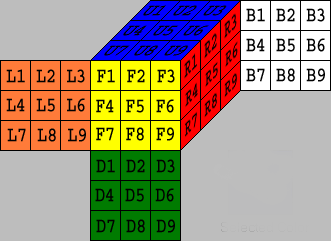
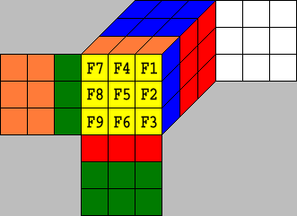
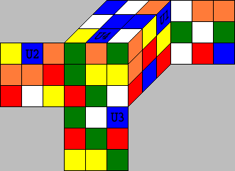

# 两阶段算法

## 0. 译序

内容来源自: http://kociemba.org/cube.htm, 翻译水平不高, 如有错误, 请指正, 谢谢!

## 1. 前言

下面的文章尝试对[Cube Explorer](http://kociemba.org/cube.htm)中的数学思想和算法进行一些介绍. 

这个过程中我会面临很多问题, 首先, 英语不是我的母语, 所以, 文中的一些描述可能很难甚至无法理解; 其次, 我学习数学已经是很久之前的事了, 所以文章中使用的一些术语显然会是不正确的; 此外, 我只能描述一些核心的思想, 以及编写Cube Explorer所需的内容.

但是, 我依然希望这篇文章会对"两阶段算法"感兴趣或者是想在自己的程序中实现两阶段算法的人有所帮助.

## 2. 置换与面

如果我们观察一个已经还原的魔方, 我们可以看到6*9个面.



如果我们对这个魔方应用一个动作, 面将会被重新排序. 这样的一个重排序, 叫做一个"置换".

我们用6个字母 -- U, R, F, D, B, L 来描述六个顺时针90°的旋转. 我们用形如F2来描述180°旋转, 用形如F'来描述270°(等价于逆时针旋转90°)旋转.

举个例子, 我们执行F动作, 会得到如下结果:



为了用程序表示这样一个置换, 我们现在只看黄色面. 这里给出了两种表达方式:

1. 移动表示法: F1移动到F3(F1 -> F3), F2 -> F6, F3 -> F9, F4 -> F2, F5 -> F5, F6 -> F8, F7 -> F1, F8 -> F4, F9 -> F7. 可以得到如下表:

F1|F2|F3|F4|F5|F6|F7|F8|F9
-|-|-|-|-|-|-|-|-
F3|F6|F9|F2|F5|F8|F1|F4|F7

2. 替换表示法: F1位置被F7替换(F1 <- F7), F2 <- F4, F3 <- F1, F4 <- F8, F5 <- F5, F6 <- F2, F7 <- F9, F8 <- F6, F9 <- F3. 可以得到如下表:

F1|F2|F3|F4|F5|F6|F7|F8|F9
-|-|-|-|-|-|-|-|-
F7|F4|F1|F8|F5|F2|F9|F6|F3

观察上面两个表格, 显然第一行都是一样的, 我们可以略去第一行, 所以, 可以简写为:

* 移动表示法: (F3,F6,F9,F2,F5,F8,F1,F4,F7)
* 替换表示法: (F7,F4,F1,F8,F5,F2,F9,F6,F3)

大多数情况下, 为了直观, 我们不会使用简写形式.

我们用第一种表示方式(移动表示法)来描述面级别的变换, 用第二种方式(替换表示法)表示块级别的变换. 这本章节的剩余部分, 将会使用移动表示法.

我们可以定义两个置换的乘积, 例如:

F1|F2|F3|F4|F5|F6|F7|F8|F9
-|-|-|-|-|-|-|-|-
F2|F1|F6|F3|F5|F4|F8|F7|F9

\*

F1|F2|F3|F4|F5|F6|F7|F8|F9
-|-|-|-|-|-|-|-|-
F3|F6|F9|F2|F5|F8|F1|F4|F7

=

F1|F2|F3|F4|F5|F6|F7|F8|F9
-|-|-|-|-|-|-|-|-
F6|F3|F8|F9|F5|F2|F4|F1|F7

> 第一个置换使得 F1 -> F2, 接下来, 第二个置换使得F2 -> F6, 所以两个复合起来, 就是F1 -> F6.

置换的乘法与自然数的乘法很相似, 但是, 这里有一个很大的不同之处: 对于自然数的乘法, 3\*5 = 5\*3, 但是对于置换的乘法, 是不满足交换律的:

F1|F2|F3|F4|F5|F6|F7|F8|F9
-|-|-|-|-|-|-|-|-
F3|F6|F9|F2|F5|F8|F1|F4|F7

\*

F1|F2|F3|F4|F5|F6|F7|F8|F9
-|-|-|-|-|-|-|-|-
F2|F1|F6|F3|F5|F4|F8|F7|F9

=

F1|F2|F3|F4|F5|F6|F7|F8|F9
-|-|-|-|-|-|-|-|-
F6|F4|F9|F1|F5|F7|F2|F3|F8

还有一个重要的概念, 叫做"逆置换".

观察如下F的置换表示:

F1|F2|F3|F4|F5|F6|F7|F8|F9
-|-|-|-|-|-|-|-|-
F3|F6|F9|F2|F5|F8|F1|F4|F7

以及另一个置换表示:

F1|F2|F3|F4|F5|F6|F7|F8|F9
-|-|-|-|-|-|-|-|-
F7|F4|F1|F8|F5|F2|F9|F6|F3

这两个置换相乘的结果是:

F1|F2|F3|F4|F5|F6|F7|F8|F9
-|-|-|-|-|-|-|-|-
F1|F2|F3|F4|F5|F6|F7|F8|F9

这个结果代表着, 什么都不做. 所以当我们用一个置换乘以它的逆置换时, 就会得到"单位置换"(用I表示). 实际上, 在这个例子中, 第二个置换就是F', 所以我们有 F \* F' = I.

你可以尝试一下, 在这种情况下, F' \* F = I也是成立的, 也就是在这种情况下, 乘法满足交换律.

在[CubeDefs.htm](http://kociemba.org/math/CubeDefs.htm#faceturns), 你可以看到每一个基本移动的完整定义. 例如:

F = (U1,U2,U3,U4,U5,U6,R1,R4,R7,D3,R2,R3,D2,R5,R6,D1,R8,R9,F3,F6,F9,F2,F5,F8,F1,F4,F7,L3,L6,L9,D4,D5,D6,D7,D8,D9,L1,L2,U9,L4,L5,U8,L7,L8,U7,B1,B2,B3,B4,B5,B6,B7,B8,B9)

> 这里采用的是简写形式

不仅仅移动的动作可以视作是一个个的置换, 每一个打乱的魔方状态也可以看做是置换. 如图:



从图中可以看出, U1 -> R3, U2 -> L2, U3 -> D3, U4 -> U8, ... , 这个魔方可以表示为: (R3, L2, D3, U8, ...).

当你求解一个魔方时, 实际上, 就是将魔方当前状态的置换表示拆分成一系列基本置换的乘积, 然后求逆置换. 置换乘以逆置换得到单位置换, 这就还原了魔方. Cube Explorer的求解算法就是尝试寻找最短的这个逆置换乘积, 例如图上的状态, 可以在几秒钟, 找到它的逆置换:

```
R2*L*U2*L2*D*R2*U2*L'*D2*R'*U*B*R'*F2*L2*B2*L2*B2
```

但是, 单纯从面级别来表示一个魔方, 还不能高效的还原一个魔方, 这里还有另外的两个级别.